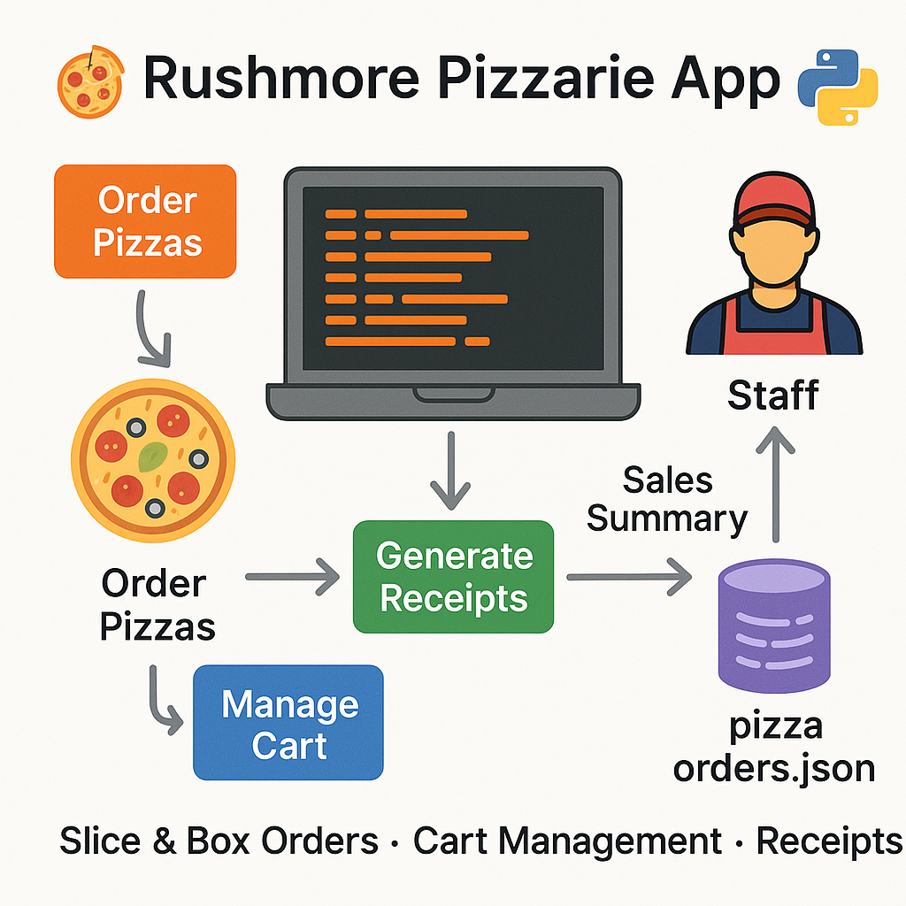
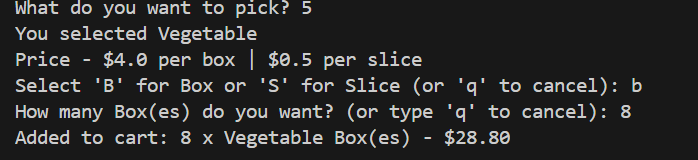
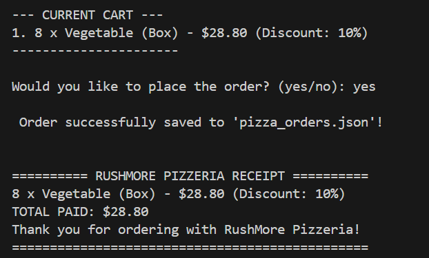
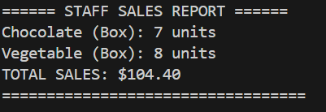

# 🍕 Rushmore Pizzeria App  

A CLI-based interactive pizza ordering system for **Rushmore Pizzeria**.  
It supports **customer order tracking**, **cart management**, **receipts**, and **staff sales summaries** — all saved in a lightweight JSON database.  


---

##  Features
- Order pizzas **by slice or box** with discounts applied automatically.  
- **Cart management**: view, edit, or clear your order before checkout.  
- **Customer receipt generation** with total cost and discounts.  
- **Staff sales reports** with item breakdowns and total revenue.  
- Persistent storage using `pizza_orders.json`.  

---
## Python Snippet
```python
def calculate_payment(price, quantity, discount_rate=0.0):
    total = price * quantity
    discount = total * discount_rate
    return total - discount
## sample screenshot for cart,receipt and sale summary.


